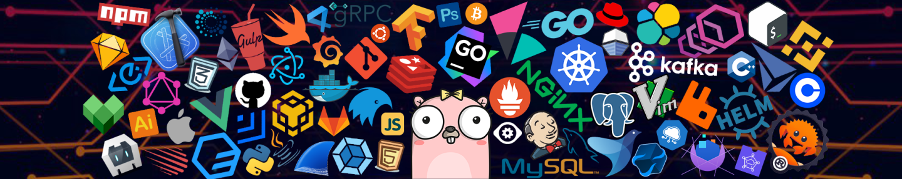

  
<strong>ABOUT</strong>

   
  <ul>
    <li><strong>Player Name</strong>: Subroto Kumar</li>
    <li><strong>Character Name</strong>: Rigel</li>
    <li><strong>Race</strong>: Otaku</li>
    <li><strong>Class</strong>: Software Engineer</li>
    <li><strong>Alignment</strong>: It works on my machine...</li>
    <li><strong>Proficiencies</strong>: Backend Developer, Flutter App Developer</li>
    <li><strong>Languages</strong>: Go, Java, Dart, JavaScript / TypeScript, Python</li>
  </ul>

  
<strong>SKILLS & ABILITIES</strong>

   
  
  
  

<!-- BLOG-POST-LIST:START -->
<!-- BLOG-POST-LIST:END -->  

<strong>CHARACTER STATS</strong>

 

<h2 align="center"> Show some ❤️ by starring some of the repositories! </h2>  
